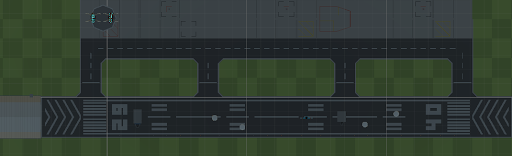

# AeroTrack - Projet étudiant

AeroTrack est un projet étudiant qui a pour but de surveiller l'état des pistes d'un aéroport à l'aide de 1 ou plusieurs drones. 
L'objectif de ce projet est de déterminer si une piste est en état d'être utilisée pour l'atterrissage ou le décollage d'un avion en détectant les éventuels trous ou autres dégradations. 
Pour ce faire, les drones parcourent la piste de chaque extrémité jusqu'au milieu, puis retournent à leur point de départ.

## Requirements

Pour commencer à exécuter ce projet, vous devez suivre quelques étapes. Tout d'abord, vous devez avoir Unity installé (version 20.3.4f), et deuxièmement, vous devriez télécharger/cloner le projet. 
Les assets visuels sont déjà présents dans le projet.

### Présentation

Pour lancer la simulation, il faudra simplement sélectionner la seule scène présente et lancer la simulation.

Les drones ne sont pas présents sur la scène et sont instanciés par la station. La station a besoin des prefabs des drones pour les instancier et des setpoints (Vector3) correspondant aux deux extrémités de la piste. 
L'ajout et la suppression d'obstacles se font dans le gameobject Obstacles. 
Les images des dégradations capturées par les drones sont enregistrées dans Assets/Images/.
